  

# Awesome Edge Computing Platform 🚀

  
  
  
  
  

---

## 💡 Overview & Market Insights 📊

Welcome to the definitive ecosystem guide for **Edge Computing Platforms**, **WebAssembly (Wasm) Runtimes**, **Distributed Cloud Infrastructure**, and **Serverless Edge Functions**! 🌐⚡

### 📈 Market Size & Industry Dynamics

> [!NOTE]
> The global **Edge Computing market** is projected to grow from **$250+ Billion in 2026** to over **$1+ Trillion by 2035**, driven by real-time AI inference, IoT endpoints, 5G deployments, and low-latency serverless requirements.
> 
> The competitive landscape is currently **moderately fragmented**. Centralized hyperscalers (AWS, GCP, Azure), specialized global edge networks (Cloudflare, Fastly, Akamai), and container runtime innovations (WebAssembly, Kubernetes Edge Orchestration) compete across different tiers of the edge computing stack.

---

## 📑 Table of Contents 📌

- [☁️ SaaS & Hosted Edge Platforms](#️-saas--hosted-edge-platforms)
- [🔓 Open-Source GitHub Projects](#-open-source-github-projects)
  - [⚙️ WebAssembly Runtimes & Engines](#️-webassembly-runtimes--engines)
  - [☸️ Edge Kubernetes & Orchestration](#️-edge-kubernetes--orchestration)
  - [⚡ Edge Functions & Serverless Frameworks](#-edge-functions--serverless-frameworks)
- [🤝 How to Contribute](#-how-to-contribute)
- [☕ Support & Sponsorship](#-support--sponsorship)
- [📈 Star History](#-star-history)
- [⚠️ Disclaimer](#️-disclaimer)

---

## ☁️ SaaS & Hosted Edge Platforms 🏢

The following curated table compares leading commercial SaaS products for edge functions, Wasm deployment, and distributed edge computing. Platforms are sorted by enterprise scale, revenue, and valuation (descending).

| Platform 🚀 | Market Scale / Valuation 💰 | Starting Paid Price 💳 | Free Tier Limits 🎁 | Key Strengths & Core Features 🌟 |
| :--- | :--- | :--- | :--- | :--- |
| **[Cloudflare Workers](https://workers.cloudflare.com/)** ⚡ | **$125B Valuation** ($2.86B ARR) | $5.00 / month | 100,000 requests/day, 10ms CPU time/request | V8 isolates runtime, sub-millisecond cold starts, Durable Objects, KV, R2, 300+ global PoPs. |
| **[Akamai EdgeWorkers](https://www.akamai.com/products/edgeworkers)** 🌐 | **$16B Valuation** ($4.32B ARR) | Contract / Custom Tier | 30-Day Free Trial (or Free Evaluation Tier in Control Center) | CDN-embedded JavaScript runtime, traffic orchestration, A/B testing, auth token validation, paired with EdgeKV. |
| **[Vercel Edge Functions](https://vercel.com/docs/functions/edge-functions)** 📐 | **$9.3B Valuation** ($500M ARR) | $20.00 / seat / month | 1M invocations/mo, 4 CPU-hours/mo, 360 GB-hours memory | Frontend framework integration (Next.js), Fluid Compute architecture, instant deployment preview workflows. |
| **[Fastly Compute](https://www.fastly.com/products/edge-compute)** ⏩ | **$4.0B Valuation** ($732M ARR) | $0.50 / M requests (Pay-as-you-go) | 10 Million Compute requests/month free | Lucet/Wasmtime WebAssembly runtime, microsecond cold starts, WebSockets, HTTP push capabilities. |
| **[Deno Deploy](https://deno.com/deploy)** 🦕 | High-Growth ($20M+ Series A) | $20.00 / month (Pro Plan) | 1 Million requests/mo, 20 GiB egress, 10 CPU-hours | Native Deno/TypeScript edge runtime, built-in KV, global edge distribution, zero config deployment. |
| **[Fly.io](https://fly.io/)** 🎈 | High-Growth ($70M+ Series B) | $5.00 / month (Hobby Minimum) | $5.00/mo credit trial (Legacy plans contain free allowances) | Containerized app distribution close to users, Sprites AI micro-VMs, Fly Postgres, multi-region deployment. |
| **[Fermyon Cloud](https://www.fermyon.com/cloud)** 📦 | Venture-Backed ($20M+ Series A) | $19.38 / month (Growth Plan) | 5 Apps, 100,000 requests/mo, 1GB KV/SQLite storage | Spin Wasm engine on Akamai Cloud, 0.52ms cold starts, native AI inference, Rust/Go/JS/Python support. |
| **[Render Edge](https://render.com/)** 🍀 | Venture-Backed ($50M+ Series B) | $7.00 / month (Starter Compute) | 750 free instance-hours/mo (Spins down after 15m idle) | Managed cloud web services, persistent WebSockets without connection caps, seamless Git deployments. |
| **[Netlify Edge Functions](https://www.netlify.com/products/edge/)** 🌐 | Private / Mid-Market ($2B+ Valuation) | $9.00 / month (Personal Plan) | 300 credits/mo (~150k requests or 15GB bandwidth) | Deno-powered edge runtime, seamless CI/CD git integration, Deploy Previews, Log Drains telemetry. |
| **[Edgio Applications](https://edg.io/)** 🏛️ | Acquired / Restructuring (Akamai) | N/A (Acquired / Inactive) | Legacy trial unavailable | Former Layer0 edge platform; operations transition to Akamai CDN & security infrastructure. |

---

## 🔓 Open-Source GitHub Projects 🛠️

The open-source edge computing ecosystem provides powerful self-hostable WebAssembly runtimes, Kubernetes edge orchestrators, and serverless function engines. Sorted by **GitHub Stars_Counts** (descending).

### ⚙️ WebAssembly Runtimes & Engines

- **[k3s](https://github.com/k3s-io/k3s)**  🌟
  Lightweight Kubernetes distribution designed for IoT, Edge computing, and ARM architectures. Memory footprint under 100MB.
- **[Wasmtime](https://github.com/bytecodealliance/wasmtime)**  🌟
  Standalone WebAssembly runtime created by the Bytecode Alliance. Fast, secure, and configurable engine powering wasmCloud and Fastly Compute.
- **[Wasmer](https://github.com/wasmerio/wasmer)**  🌟
  High-performance WebAssembly runtime supporting WASI and Emscripten, enabling universal binary execution across edge and desktop environments.
- **[WasmEdge](https://github.com/WasmEdge/WasmEdge)**  🌟
  CNCF sandbox lightweight, extensible WebAssembly runtime for cloud-native, edge serverless, and AI inference workloads.
- **[wasmCloud](https://github.com/wasmCloud/wasmCloud)**  🌟
  CNCF application platform for compiling code to Wasm components runnable anywhere from laptop to edge cluster with lattice networking.
- **[NovaCompute](https://github.com/anand-exe7/NovaCompute)**  🌟
  Pure Go multi-tenant Wasm serverless edge engine with sub-millisecond execution, zero cold starts, and PostgreSQL + Redis state management.

### ☸️ Edge Kubernetes & Orchestration

- **[MicroK8s](https://github.com/canonical/microk8s)**  🌟
  Canonical's zero-ops, lightweight Kubernetes for edge devices, IoT gateways, and workstation development environments.
- **[KubeEdge](https://github.com/kubeedge/kubeedge)**  🌟
  CNCF graduated Kubernetes-native edge computing framework extending container orchestration to edge hosts with offline autonomy.
- **[Baetyl](https://github.com/baetyl/baetyl)**  🌟
  LF Edge project extending cloud computing and AI inference to edge devices with native support for 30+ industrial protocols.
- **[EVE-OS](https://github.com/lf-edge/eve)**  🌟
  LF Edge virtualization engine (Project EVE) for secure cloud-native edge computing and on-premise hardware orchestration.
- **[SpinKube](https://github.com/spinkube/spin-operator)**  🌟
  Open-source Kubernetes extension using Spin Operator and runwasi to execute WebAssembly workloads alongside standard containers.

### ⚡ Edge Functions & Serverless Frameworks

- **[NATS Server](https://github.com/nats-io/nats-server)**  🌟
  CNCF cloud-native messaging and edge event-streaming system powering distributed control planes, microservices, and Wasm mesh lattices.
- **[OpenFaaS](https://github.com/openfaas/faas)**  🌟
  Popular open-source serverless framework for building and deploying function containers on Kubernetes and edge nodes.
- **[Knative Serving](https://github.com/knative/serving)**  🌟
  Kubernetes-based serverless platform providing request-driven autoscaling, scale-to-zero, and event routing for edge clusters.
- **[Nuclio](https://github.com/nuclio/nuclio)**  🌟
  High-performance serverless event and data processing platform optimized for real-time edge analytics and AI inference workloads.

---

## 🤝 How to Contribute 🛠️

Contributions are welcome! Help us keep this directory accurate and up to date:

1. 🍴 **Fork** this repository.
2. ✏️ Add or update entries in `README.md` keeping formatting consistent.
3. 📝 Ensure SaaS products include pricing, free tier limits, and scale information.
4. 🔀 Open a **Pull Request** with a concise description of your additions.

---

## ☕ Support & Sponsorship 💗

If you find this repository helpful, please consider supporting the project:

- ⭐ **Star** this repository to increase its visibility.
- 🔄 **Fork** and share it with your dev network and platform engineering teams.
- 💖 **Sponsor** the maintainer on GitHub: [https://github.com/sponsors/ishandutta2007](https://github.com/sponsors/ishandutta2007)

*Thank you for your support! Your encouragement helps keep this ecosystem directory maintained and active.* 🚀

---

## 📈 Star History 📊

---

## ⚠️ Disclaimer 📜

- This list is **community-curated** for informational and educational purposes.
- Product features, pricing, and free tier limits change frequently; refer to official platform websites for up-to-date documentation.
- Check out the master list of awesome lists at [Awesome-Awesome-Awesome](https://github.com/ishandutta2007/Awesome-Awesome-Awesome).

---

**Made with ❤️ for edge computing engineers, WebAssembly developers, and serverless architects.**
